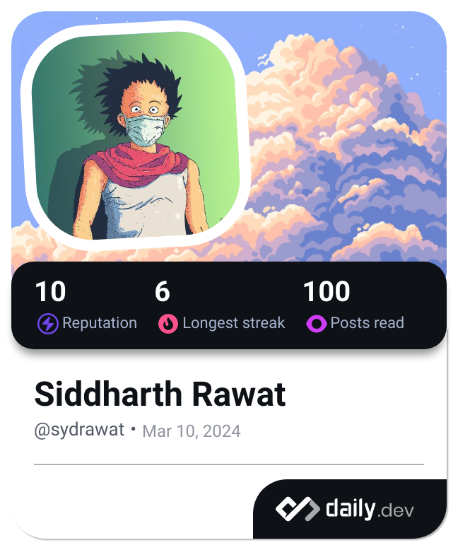

Hey, I'm Sid! 

:mortar_board: I'm a Graduate student pursuing my Masters in Information Systems at the College of Engineering in Northeastern University, Boston.

:monocle_face: I'm interested in `Site Reliability Engineering`, `DevOps` and `Fullstack Engineering`! I just finished my Spring '23 Co-op as a Software Engineer at [@Boehringer-Ingelheim USA](https://github.com/Boehringer-Ingelheim), developing GPT powered chatbots for medical websites using `Azure OpenAI` & `Power Virtual Agents`, using `Kubernetes` and `Helm Charts` to deploy a highly available cluster for the chatbots.

:office: Prior to my studies at Northeastern, I worked as a Senior Software Engineer in the PaaS team for Ericsson, Hungary as an Embedded Software developer and as a Front-End developer for Uber at Wipro Ltd. I was mainly involved in the development and maintenance of Ericsson's commercial router.

:technologist: Currently, I working on a project where I work with a highly available `kubernetes cluster` which hosts a `containerized REST API` that is being deployed on a `regional`, `multi-nodal` `private` `GKE cluster` using `Helm Charts`. Logging and monitoring of metrics is done using `Prometheus` and `Grafana`. A custom health check on this REST API is done by a highly available `Kafka cluster` (deployed using the `Bitnami Kafka Helm Chart` as a dependency) on the same `GKE cluster` using the traiditonal `producer-consumer` model.

:globe_with_meridians: Find out more about me [here]!

:memo: Occasionally write about stuff in my [Blog]. I intend to start writing more blogs on DevOps, so stay tuned!

<!-- Links -->

[blog]: https://sydrawat.live/blog/
[here]: https://sydrawat.live/

<picture>
  <source media="(prefers-color-scheme: dark)" srcset="https://raw.githubusercontent.com/sydrawat01/sydrawat01/output/github-contribution-grid-snake-dark.svg">
  <source media="(prefers-color-scheme: light)" srcset="https://raw.githubusercontent.com/sydrawat01/sydrawat01/output/github-contribution-grid-snake.svg">
  
</picture>
